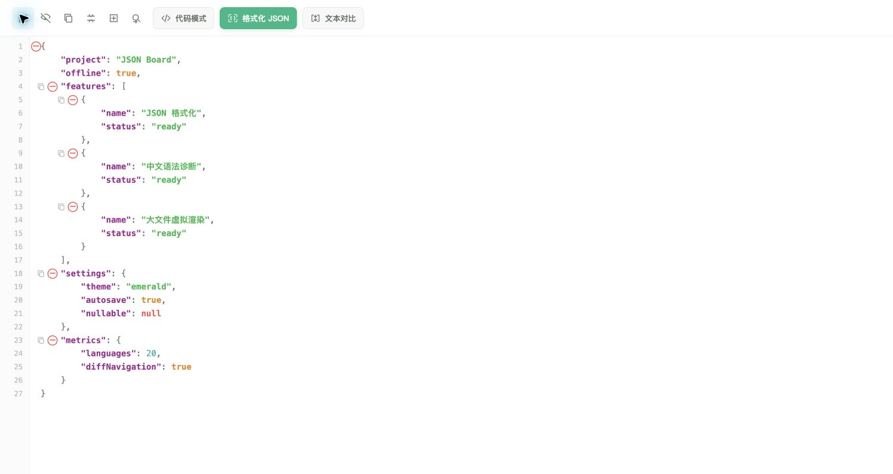
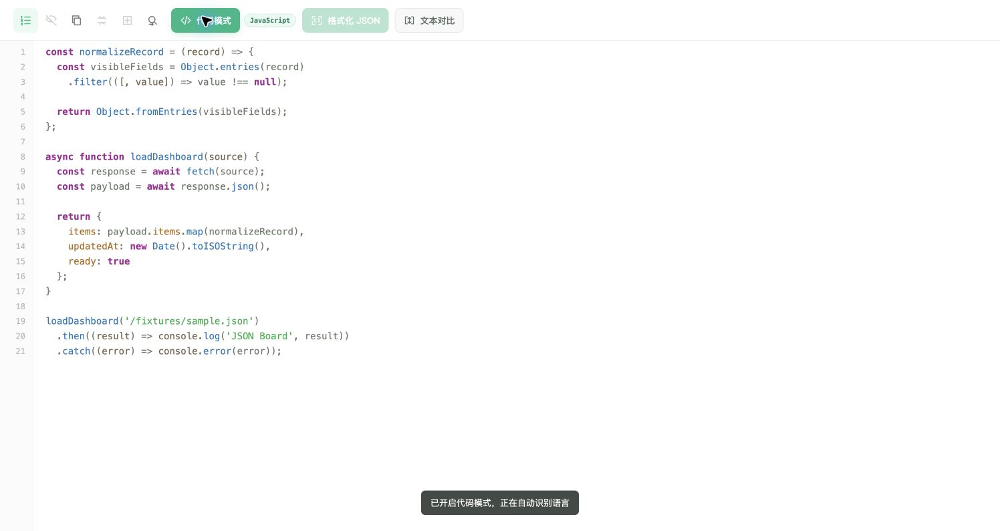
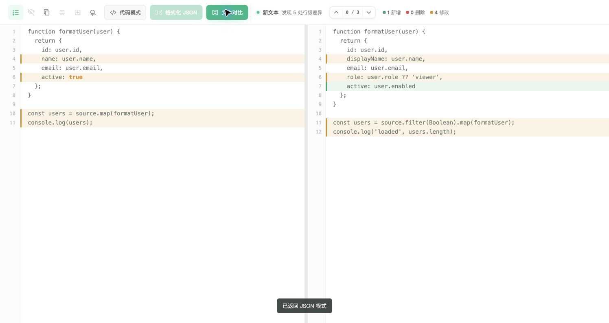

<p align="center">
  
</p>

<h1 align="center">JSON Board</h1>

<p align="center">
  一个离线优先、打开即用的 JSON 与代码工作台。
  <br>
  格式化、折叠、诊断、代码高亮、查找替换和文本对比，全都留在本地浏览器里完成。
</p>

<p align="center">
  <a href="https://github.com/PianoCello/json-board/actions/workflows/test.yml"></a>
  <a href="LICENSE"></a>
  
  
</p>

<p align="center">
  <a href="https://pianocello.github.io/json-board/"><strong>在线使用 JSON Board →</strong></a>
</p>



## 为什么用它

JSON Board 不需要安装、不需要构建，也不会把文本传到服务器。下载仓库后直接打开 `index.html`，就能获得接近桌面编辑器的体验。

| 能力 | 说明 |
| --- | --- |
| JSON 工作台 | 自动格式化、行号、折叠、片段复制、一键展开与隐藏 `null` |
| 中文诊断 | 定位缺逗号、多括号、错误引号、非法转义等常见 JSON 问题 |
| 代码模式 | 自动识别 JavaScript、TypeScript、Python、Java、SQL、Shell、HTML、CSS、Go、Rust 等语言 |
| 查找替换 | 所有匹配与当前匹配独立高亮，支持上一处、下一处、替换和全部替换 |
| 文本对比 | 任意文本左右对比，支持差异统计、变更导航和双栏同步滚动 |
| 大文件优化 | 纵向与横向虚拟渲染，超大文本使用 IndexedDB 与 gzip 本地备份 |
| 刷新恢复 | 自动保存当前文本、显示模式、行号和隐藏 `null` 状态 |

## 三种工作模式

<table>
  <tr>
    <td width="50%"><strong>代码模式</strong></td>
    <td width="50%"><strong>文本对比</strong></td>
  </tr>
  <tr>
    <td></td>
    <td></td>
  </tr>
  <tr>
    <td>自动识别语言并使用离线 Highlight.js 着色。</td>
    <td>绿色为新增，红色为删除，琥珀色为修改。</td>
  </tr>
</table>

## 快速开始

### 直接使用

```bash
git clone https://github.com/PianoCello/json-board.git
cd json-board
open index.html
```

macOS 也可以双击 [`scripts/打开 JSON 看板.command`](scripts/%E6%89%93%E5%BC%80%20JSON%20%E7%9C%8B%E6%9D%BF.command)，以最大化独立窗口打开。

### 本地服务器

```bash
npm run serve
```

然后访问 `http://localhost:4173`。

## 快捷键

| 快捷键 | 功能 |
| --- | --- |
| `Ctrl/Command + Enter` | 格式化 JSON |
| `Ctrl + H` | Windows 打开查找替换 |
| `Command + Option + F` | macOS 打开查找替换 |
| `Ctrl/Command + F` | 保留浏览器原生搜索 |
| `Tab` | 插入两个空格 |
| `←` / `→` | 聚焦分隔线时调整双栏宽度 |

## 项目结构

```text
json-board/
├── .github/workflows/      # GitHub Actions
├── docs/
│   ├── images/             # README 实际运行截图
│   └── ARCHITECTURE.md     # 架构与编辑器图层说明
├── public/icons/           # 应用图标
├── scripts/                # 本地启动脚本
├── src/
│   ├── css/app.css         # 视觉样式与编辑器图层
│   └── js/
│       ├── app.js          # 应用状态与交互
│       ├── diff-utils.js   # 行级差异算法
│       ├── editor-utils.js # 括号配对等编辑能力
│       └── json-diagnostics.js
├── tests/                  # Node.js 回归测试
├── vendor/highlightjs/     # 离线语法高亮与许可证
├── index.html              # 无构建步骤的应用入口
└── package.json            # 测试与本地开发命令
```

更多实现细节见 [架构说明](docs/ARCHITECTURE.md)。

## 开发与验证

项目没有运行时 npm 依赖。Node.js 只用于执行自动化测试：

```bash
npm run verify
```

该命令会进行 JavaScript 语法检查，并运行差异算法、括号配对、JSON 中文诊断和页面结构契约测试。每次推送和 Pull Request 也会由 GitHub Actions 自动执行同一套验证。

## 隐私与离线能力

- 编辑内容只写入浏览器的 LocalStorage 或 IndexedDB。
- 应用不会发送网络请求，也没有分析统计或后端接口。
- Highlight.js 已随项目离线打包，断网仍可进行代码高亮。
- README 徽章只在浏览 GitHub 项目页时加载，不属于应用运行时。

## 参与贡献

欢迎提交 Issue 和 Pull Request。开始前请阅读 [贡献指南](CONTRIBUTING.md) 与 [变更记录](CHANGELOG.md)。

## License

[MIT](LICENSE) © 2026 PianoCello
